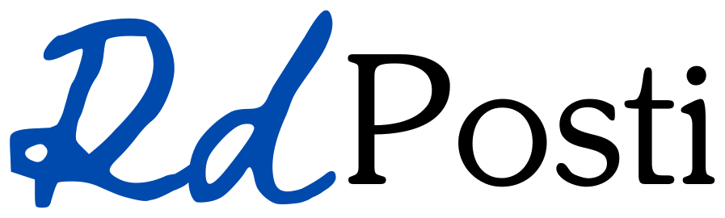

<p align="center"></p>

**RdPosti** è un'app web (HTML + CSS + JavaScript, senza installazioni) per creare la disposizione dei posti in classe
evitando di mettere vicine le persone incompatibili.

## Come si usa

1. Apri `index.html` nel browser (doppio clic sul file va benissimo).
2. **Inventario (sinistra)**: trascina *Banco* e *Cattedra* nell'aula. I banchi messi uno accanto all'altro
   si **uniscono** in un unico gruppo. Ci sono anche disposizioni rapide (file a coppie, isole da 4, ferro di cavallo).
   - doppio clic su una casella vuota → aggiungi un banco
   - doppio clic su un oggetto, oppure trascinarlo fuori dall'aula → rimuovilo
   - clic destro sulla cattedra → ruotala
3. **Studenti (destra)**: scrivi `Nome Cognome, Nome Cognome, ...`: la tabella si compila da sola.
4. **Regole (in basso, clic sull'icona)**: scegli chi *non deve stare vicino* a chi, chi deve stare vicino,
   chi va in prima/ultima fila (o non ci deve andare).
5. Premi **Genera disposizione**. Ogni volta esce una disposizione casuale diversa che rispetta le regole.
   Clicca due banchi per scambiare a mano due studenti: le regole vengono ricontrollate subito.

Tutto viene salvato automaticamente nel browser. Con *Esporta*/*Importa* puoi passare la classe a un altro computer,
con *Stampa* ottieni la piantina.

## Come funziona l'algoritmo

- **Union-Find** (`js/unionfind.js`): ogni banco è un insieme; se due banchi sono adiacenti (sopra/sotto/destra/sinistra)
  i loro insiemi vengono uniti. Così si scoprono i gruppi di banchi attaccati.
- **Geometria** (`buildLayout` in `js/solver.js`): per ogni coppia di posti calcola se sono *accanto*, *davanti/dietro*,
  in *diagonale* o *nello stesso gruppo*. Le file sono ordinate partendo da quella più vicina alla cattedra
  (se la cattedra è in basso, la prima fila è in basso).
- **Simulated annealing** (`solve`): parte da una permutazione casuale degli studenti e prova a scambiare due posti alla
  volta. Ogni regola ha una penalità (es. incompatibili accanto = 1000, davanti/dietro = 450, diagonale = 150):
  gli scambi che abbassano la penalità vengono accettati, quelli che la alzano solo ogni tanto (sempre meno col passare
  del tempo), così l'algoritmo non resta bloccato. Se le regole sono impossibili da rispettare tutte, mostra quelle violate.

## Font e icone

- Il font del logo è **Della Respira** (SIL Open Font License, vedi `assets/fonts/OFL.txt`), incluso in locale e usato in tutta l'app.
- Le icone sono SVG lineari (stile Lucide) definite una volta in `index.html` e riusate con `<use href="#i-...">`.

## Test

```bash
npm test
```

## Struttura

```
index.html          pagina
css/style.css       stile
js/unionfind.js     Union-Find
js/solver.js        geometria dell'aula + algoritmo
js/app.js           interfaccia, drag & drop, regole
tests/              test dell'algoritmo (node --test)
assets/logo.png     logo
assets/fonts/       font Della Respira + licenza
```
